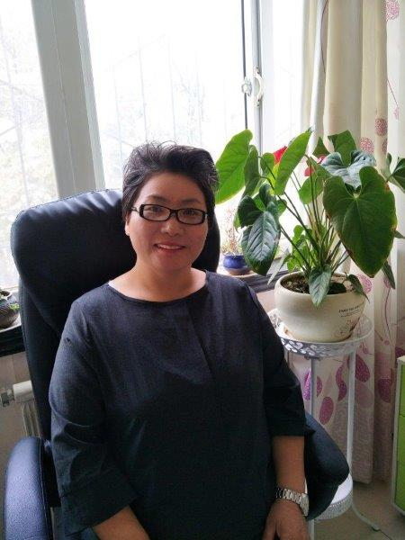

+++
title = "关于我们"
description = "关于我们"
isCJKLanguage = true
+++

## 公司简介
宁夏爱银龄养老咨询管理有限公司旨在促进中国高质量，全面的养老护理服务。 我们与国际养老护理服务联合，通过养老护理员培训和发展，养老护理咨询来支持家庭，社区和养老院等养老护理行业。

------------

## 公司背景
宁夏爱银龄养老咨询管理有限公司是成立于2016年10月份的一家外商独资企业。

------------

## 国外养老专家简介 - 许洋 (Grace Heo)
1997 年许洋在澳大利亚悉尼大学获得老年学硕士学位，在此之前她也一直在悉尼养老护理领域工作。1996 年，许洋被邀请并由韩国总统颁发韩裔对世界有杰出贡献的知名人士之一。她在养老行业有25 年以上的经验，从养老护理到管理养老机构，许洋担任过各种各样的职位。她对于老年人的了解和认识，以及对于养老护理行业的热情，使她能成为一名优秀的老年护理顾问。

-----

